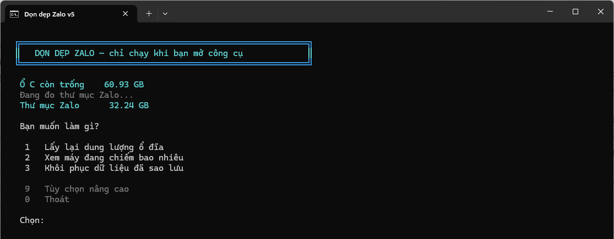
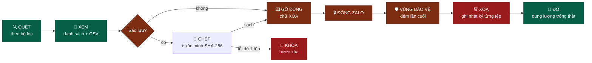
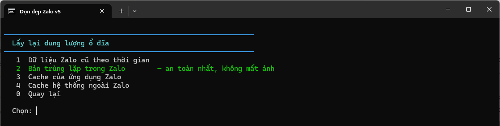
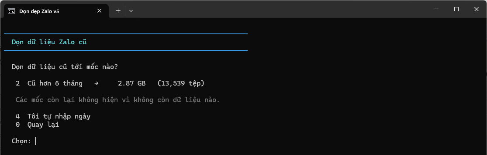
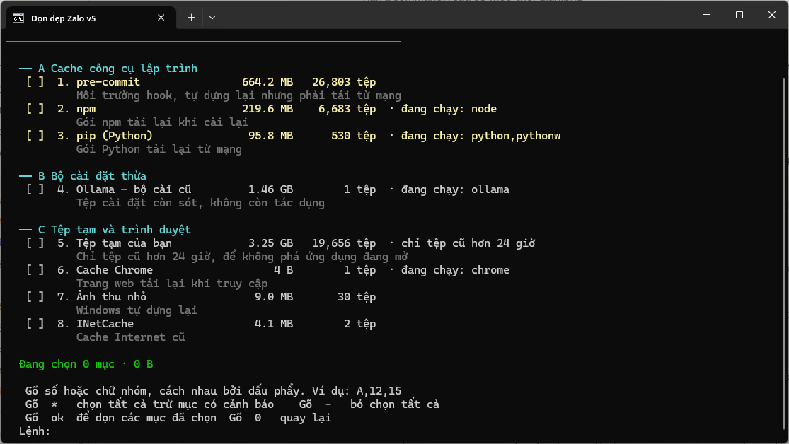

<div align="center">

# 🧹 Dọn dẹp Zalo

### Lấy lại dung lượng ổ đĩa bị Zalo chiếm trên Windows — mà không mất một tấm ảnh nào

*Một tệp PowerShell. Không cài đặt, không phụ thuộc, không chạy nền. Xem trước rồi mới xóa, sao lưu có xác minh, và nói thật với bạn về việc dung lượng có thực sự quay về hay không.*



[](https://github.com/doivamong/zalo-cleanup)
[](https://learn.microsoft.com/powershell/)
[](#-cài-đặt-60-giây)
[](#-phát-triển--đóng-góp)
[](LICENSE)

<kbd>[📌 Vì sao](#-vì-sao-có-công-cụ-này)</kbd> ·
<kbd>[✨ Làm gì](#-công-cụ-làm-gì)</kbd> ·
<kbd>[🚀 Cài đặt](#-cài-đặt-60-giây)</kbd> ·
<kbd>[🧭 Cách dùng](#-cách-dùng)</kbd> ·
<kbd>[💽 Shadow Copy](#-vì-sao-dọn-xong-mà-ổ-đĩa-không-trống-thêm)</kbd> ·
<kbd>[🛡️ An toàn](#️-thiết-kế-an-toàn)</kbd> ·
<kbd>[📚 Tham chiếu](#-tham-chiếu)</kbd> ·
<kbd>[🔧 Sự cố](#-xử-lý-sự-cố)</kbd>

</div>

---

## 📌 Vì sao có công cụ này

> **Bài toán:** Zalo lưu mọi ảnh, video, tệp bạn nhận được vào ổ C và không bao giờ tự dọn theo cách bạn kiểm soát được. Sau vài năm, con số thường là vài chục GB. Tệ hơn: nó lưu **hai bản** của cùng một tấm ảnh, nên gần một nửa chỗ đó là bản thừa.

> **Cách tiếp cận:** Công cụ ra đời sau một sự cố mất dữ liệu — khoảng **31,8 GB** ảnh trong thư mục `picture\` bị một tiến trình tự động xóa vĩnh viễn, không qua Thùng rác, ngay giữa lúc đang phân tích thư mục đó. Bài học rút ra định hình toàn bộ thiết kế: **thời điểm xóa phải do bạn quyết, và bạn phải nhìn thấy chính xác cái gì sắp mất trước khi nó mất.**

> **Kết quả:** Không Scheduled Task · Không tiến trình nền · Không xóa khi khởi động lại · Quét trước mới xóa được · Khử trùng lặp xác minh bằng SHA-256 toàn tệp · Sao lưu phải sạch mới cho xóa · Vùng bảo vệ chặn cứng ở tầng code · Đo dung lượng trống thật trước và sau mỗi lần dọn.

*Nếu bạn chỉ muốn một nút "dọn cho nhanh", công cụ này sẽ khiến bạn bực. Nó cố tình bắt bạn nhìn trước khi bấm.*

<details>
<summary><b>🇬🇧 English Summary</b></summary>

<br>

**zalo-cleanup** reclaims disk space taken by [Zalo](https://zalo.me) — Vietnam's dominant messaging app, which stores every received photo and video on your system drive indefinitely. It routinely accumulates tens of gigabytes. The interface is in Vietnamese, matching its intended users.

**What makes it different from a generic cleaner:**

| | |
|:---|:---|
| **Scan-then-delete is enforced** | Nothing can be deleted that you have not seen listed first. Changing a filter invalidates the previous scan. |
| **Duplicate detection verifies content** | Zalo stores each media file twice — once standalone, once under `resource\<conversationId>\`. Candidates are matched by size, then a 64 KB head/tail signature, then confirmed by a **full-file SHA-256**. Only the last step is allowed to conclude. In one real run, 11 same-size candidates were rejected at the hash step. |
| **Backups are verified before deletion is permitted** | Size is checked for every file, plus SHA-256 on a sample or the full set. A single copy or verification failure blocks the delete step. |
| **It tells the truth about Volume Shadow Copy** | Deleting files while a System Restore snapshot exists moves freed blocks into shadow storage instead of returning them to the volume — measured: deleting 12.96 GB returned 0.04 GB. The tool measures free space before and after every run and warns when the numbers disagree. |
| **Hard-coded protected zones** | Covers the Zalo message database, Windows system directories, and installed toolchains — checked in both directions (a path *containing* a protected zone is refused too) and never traversing junctions or symlinks. |
| **Manual only, by design** | No scheduled task, no background service, no delete-on-reboot. Every action completes before you close the window. |

Requires Windows 10/11 and the built-in PowerShell 5.1. No installation, no dependencies. Ships with a **204-case regression suite** that builds its own sandbox in `%TEMP%`.

Not affiliated with VNG Corporation. MIT licensed.

</details>

---

## ✨ Công cụ làm gì

> *Bốn nguồn dung lượng, xếp từ an toàn nhất tới cần cân nhắc nhất.*

| Nguồn | Lấy lại được gì | Rủi ro |
|:---|:---|:---|
| **🟢 Bản trùng lặp trong Zalo** | Bản thừa mà Zalo tự nhân đôi. Thường chiếm gần một nửa thư mục | **Không mất tấm ảnh nào.** Mỗi tệp bị xóa đều đã đối chiếu SHA-256 với một bản giống hệt đang giữ lại |
| **🟢 Cache của ứng dụng Zalo** | `Cache`, `Code Cache`, `GPUCache`, `media\update`, `media\temp` | Zalo tự tạo lại. Không chứa tin nhắn hay media đã nhận |
| **🟡 Cache hệ thống ngoài Zalo** | npm, pip, cargo, Playwright, Temp, cache trình duyệt… theo danh sách trắng | Ứng dụng tự dựng lại, nhưng mục màu vàng phải tải lại từ mạng |
| **🔴 Dữ liệu Zalo cũ theo thời gian** | Ảnh, video, tệp cũ hơn mốc bạn chọn | **Dữ liệu thật.** Ảnh quá hạn lưu trên máy chủ Zalo sẽ mất vĩnh viễn |

### Chuỗi cửa trước khi một tệp bị xóa



*Đổi bộ lọc là kết quả quét cũ bị hủy — không bao giờ xóa theo một danh sách lỗi thời.*

---

## 🚀 Cài đặt 60 giây

### Yêu cầu

| | |
|:---|:---|
| **Hệ điều hành** | Windows 10 hoặc Windows 11 |
| **PowerShell** | 5.1 — có sẵn trong Windows, **không cần cài gì thêm** |
| **Zalo** | Không bắt buộc. Máy chưa cài Zalo vẫn dùng được phần cache hệ thống |
| **Quyền quản trị** | Không bắt buộc. Chỉ cần cho cache cấp hệ thống và thao tác Shadow Copy |
| **Phụ thuộc** | **Không có.** Không .NET riêng, không Python, không mô-đun bên thứ ba |

### Cách 1 — Tải bản nén *(khuyến nghị)*

```
1. Bấm nút xanh  Code  →  Download ZIP
2. Giải nén ra thư mục bất kỳ, ví dụ  D:\zalo-cleanup
3. Bấm đúp  ZaloCleanup.cmd
```

### Cách 2 — Clone bằng Git

```bash
git clone https://github.com/doivamong/zalo-cleanup.git
cd zalo-cleanup
```

Rồi bấm đúp `ZaloCleanup.cmd`.

### Kết quả thành công

Công cụ đo dung lượng ổ đĩa và thư mục Zalo, rồi hỏi bạn muốn làm gì. Không có bước cấu hình nào.


<details>
<summary><b>⚙️ Chạy trực tiếp tệp <code>.ps1</code> · SmartScreen · Chép sang máy khác</b></summary>

<br>

**Chạy trực tiếp `.ps1`:**

```powershell
powershell -NoProfile -ExecutionPolicy Bypass -File ".\ZaloCleanup.ps1"
```

Tệp tải từ mạng mang dấu Mark-of-the-Web nên PowerShell có thể từ chối chạy. Gỡ dấu đó một lần:

```powershell
Get-ChildItem -Recurse | Unblock-File
```

`ZaloCleanup.cmd` đã bao sẵn `-ExecutionPolicy Bypass` nên nếu dùng nó thì bạn không gặp vấn đề này. Công cụ **không** thay đổi Execution Policy của máy bạn.

**SmartScreen:** Windows có thể cảnh báo vì tệp vừa tải từ mạng. Bấm **More info** → **Run anyway**. Bạn cũng có thể đọc toàn bộ mã nguồn trước khi chạy — đó là điểm chính của việc nó là mã mở.

**Chép sang máy khác:** chép cả thư mục là dùng được. Công cụ không giả định gì về máy đích:

| Không giả định | Cách xử lý |
|:---|:---|
| **Ổ C** | Mọi đường dẫn hệ thống lấy từ `%SystemDrive%`, `%WINDIR%`, `%ProgramData%`, `%ProgramFiles%` |
| **Ngôn ngữ Windows** | Đầu ra `vssadmin` bị bản địa hóa nên in nguyên văn thay vì lọc theo từ khóa tiếng Anh |
| **Định dạng số vùng miền** | `20,000` và `20.000` đều đọc đúng |
| **Bảng mã console** | Đặt về UTF-8 lúc khởi động, trả lại nguyên trạng lúc thoát |
| **Hỗ trợ đường dẫn dài** | Tự phát hiện và dùng tiền tố `\\?\` khi cần |
| **Controlled Folder Access** | Tự phát hiện và cảnh báo trước thay vì để bạn nhận một loạt lỗi khó hiểu |

</details>

---

## 🧭 Cách dùng

### Nếu bạn chỉ muốn thử cho an tâm

Chọn **`2`** — chỉ đọc và báo cáo, **không đụng vào bất cứ thứ gì**. Bạn sẽ biết Zalo đang chiếm bao nhiêu và nằm ở những thư mục nào.

### Lần dọn đầu tiên nên bắt đầu từ đâu

Chọn **`1`** → **`2` — Bản trùng lặp trong Zalo**. Đây là lựa chọn an toàn nhất, và với nhiều người riêng bước này đã lấy lại hơn 10 GB.



*Lựa chọn an toàn nhất được tô xanh sẵn để bạn khỏi phải đoán.*

<details>
<summary><b>🟢 Bản trùng lặp — vì sao xóa được mà không mất ảnh</b></summary>

<br>

Zalo lưu mỗi tấm ảnh và mỗi video **hai bản**: một bản độc lập trong `video\ picture\ voice\ file\`, một bản trong `resource\<mã hội thoại>\`. Chế độ này tìm bản thừa bên `resource\` và **luôn giữ bản độc lập**.

Quy trình bốn bước, và **kết luận luôn là một phép so SHA-256 trên toàn bộ nội dung**:

| # | Bước | Vai trò | Đọc nội dung |
|:-:|:---|:---|:---|
| 1 | Lập chỉ mục bản giữ lại theo kích thước | Thu hẹp không gian tìm kiếm | Không, chỉ metadata |
| 2 | Lọc ứng viên trùng kích thước | Loại nhanh phần lớn | Không, chỉ metadata |
| 3 | Chữ ký 64 KB đầu + 64 KB cuối | Loại tiếp mà chưa phải đọc cả tệp | Một phần |
| 4 | **SHA-256 toàn bộ nội dung** | **Chỉ bước này được kết luận** | Toàn bộ |

Tệp **từ 128 KB trở xuống** thì bước 3 đã đọc trọn vẹn cả tệp rồi, nên chữ ký của nó *chính là* SHA-256 toàn tệp — bước 4 dùng lại chứ không mở tệp ra đọc lần nữa. Điều kiện để kết luận không hề nới lỏng: vẫn là đối chiếu SHA-256 toàn tệp, chỉ là thôi đọc thừa.

Bước 4 không thừa. Trong một lần chạy thực tế, **11 ứng viên trùng kích thước đã bị loại ở bước băm** vì nội dung khác nhau. Nếu đoán theo tên hoặc kích thước, 11 tệp đó đã bị xóa oan.

**Tốc độ.** Việc băm chia cho 8 luồng cùng đọc đĩa. Chỉ phép băm chạy song song — nó thuần tính toán; mọi khâu so sánh, loại bỏ và xóa vẫn nằm ở luồng chính để đọc mã còn kiểm được. Đo trên máy thật (i5-12400, SSD SATA): một luồng đọc được 41 MB/s, tám luồng 53 MB/s — nút cổ chai là ổ đĩa chứ không phải CPU, vì SHA-256 chạy tới 840 MB/s khi dữ liệu đã nằm trong bộ nhớ. Cộng với việc bỏ lượt đọc thừa ở bước 4, một lượt quét thử 13.000 tệp mô phỏng đúng hồ sơ dữ liệu thật giảm từ **7,1 giây xuống 1,0 giây**. Lần chạy đầu tiên, khi tệp chưa nằm trong bộ nhớ đệm, phần thắng còn khoảng **2,6 lần** — lúc đó tốc độ ổ đĩa mới là thứ quyết định.

*Chế độ này bỏ qua bộ lọc thời gian.*

</details>

<details>
<summary><b>🔴 Dữ liệu Zalo cũ theo thời gian — mốc có sẵn dung lượng</b></summary>

<br>

Công cụ đo sẵn từng mốc rồi mới hỏi bạn — bạn thấy con số trước khi chọn, không phải chọn rồi mới biết.



Mốc nào không còn dữ liệu sẽ **tự ẩn kèm lời giải thích**, thay vì hiện một lựa chọn 0 byte vô nghĩa. Ảnh trên là máy đã dọn sạch phần cũ nên chỉ còn một mốc.

Đây là **dữ liệu thật** — ảnh và video quá hạn lưu trên máy chủ Zalo sẽ mất vĩnh viễn, nên bước xác nhận ở đây nặng nhất: phải gõ đúng chữ `XÓA`.

</details>

<details>
<summary><b>🟡 Cache hệ thống — danh sách trắng, không dò theo tên</b></summary>

<br>

Chế độ duy nhất hoạt động ngoài phạm vi Zalo. Nó chạy trên một **danh sách trắng** gồm 33 vị trí, chia ba nhóm:

| Nhóm | Nội dung |
|:-:|:---|
| **A** | Cache công cụ lập trình — npm, pip, uv, cargo, Playwright, Puppeteer, HuggingFace, pre-commit… |
| **B** | Bộ cài đặt thừa — tệp cài còn sót của Ollama, LM Studio, driver Intel, GIGABYTE |
| **C** | Tệp tạm và trình duyệt — Temp, cache Chrome/Edge/Firefox, ảnh thu nhỏ, INetCache, crash dump, Windows Update đã cài |

> **Công cụ không bao giờ dò tìm theo mẫu tên** kiểu `*cache*`. Rất nhiều ứng dụng đặt tên thư mục là `Cache` nhưng bên trong là dữ liệu thật không tái tạo được; quét theo mẫu tên chính là cách làm hỏng máy.



Mỗi mục hiện dung lượng đo trực tiếp, số tệp, mô tả mất gì khi xóa, và các nhãn cảnh báo: `đang chạy: node` khi có tiến trình đang dùng, `chỉ tệp cũ hơn 24 giờ` khi mục có ngưỡng tuổi, `cần quyền quản trị` khi thiếu quyền ghi. Mục màu vàng là loại phải tải lại từ mạng. Mục nào không tồn tại trên máy sẽ tự ẩn.

**Cách chọn:** gõ số, chữ nhóm, hoặc trộn cả hai — ví dụ `A,12,15`. Gõ `-` bỏ chọn hết, `*` chọn tất cả, `ok` để quét, `admin` để mở lại với quyền quản trị. Nhập sai thì giữ nguyên lựa chọn.

**Ba lớp phanh:**

| Lớp | Hành vi |
|:---|:---|
| **Mục có cảnh báo** | `*` và chữ nhóm **bỏ qua** chúng và nói rõ đã bỏ mục nào — muốn chọn phải cố ý gõ số |
| **Mục chưa kiểm chứng** | Bắt xác nhận riêng trước khi quét |
| **Ứng dụng đang chạy** | Dừng lại ở bước `ok` và cho ba đường xử lý |

Ngưỡng tuổi cho `%TEMP%`: hai mục tệp tạm **chỉ xóa tệp cũ hơn 24 giờ**, vì `%TEMP%` chứa tệp làm việc của mọi ứng dụng đang mở. Xóa tệp tạm vừa được tạo có thể làm hỏng tiến trình đang chạy theo cách rất khó chẩn đoán — tệp không hề bị khóa nên thao tác xóa vẫn thành công.

</details>

<details>
<summary><b>🔁 Vì sao chặn khi ứng dụng đang chạy</b></summary>

<br>

```
  3 mục đang được ứng dụng khác sử dụng:
   · npm                      đang chạy: node
   · pip (Python)             đang chạy: python, pythonw
   · Cache Chrome             đang chạy: chrome

   1  Bỏ các mục đó ra, dọn phần còn lại
   2  Cứ dọn hết
   Enter để quay lại, tự đóng ứng dụng rồi thử lại
```

Trong một lần đo thực tế, xóa `Ollama\updates_v2` (**1.491 MB**) lúc 02:52 thì tiến trình Ollama tải lại đúng tệp đó lúc **03:03**. Dọn xong không thu được gì mà còn tốn băng thông.

Công cụ đọc lại danh sách tiến trình **ngay tại thời điểm bấm `ok`**, không dùng ảnh chụp lúc mở màn hình — bạn có thể vừa đóng ứng dụng xong.

*Công cụ **không bao giờ tự tắt ứng dụng của bạn**. Chỉ Zalo mới bị đóng, và việc đó có xác nhận riêng.*

</details>

---

## 💽 Vì sao dọn xong mà ổ đĩa không trống thêm

> *Đây là điều quan trọng nhất cần hiểu nếu mục tiêu của bạn là lấy lại dung lượng thật chứ không phải một con số đẹp trong báo cáo.*

**Cơ chế.** Volume Shadow Copy — thứ đứng sau System Restore và Previous Versions — dùng **copy-on-write**. Khi tồn tại một bản chụp và bạn xóa tệp đã có mặt lúc chụp, Windows phải giữ lại nội dung cũ cho bản chụp đó, nên nó **chép các khối dữ liệu sang vùng shadow storage trước khi cho phép xóa**.

Kết quả: bạn giải phóng X byte khỏi hệ thống tệp và tiêu tốn đúng X byte ở vùng chụp. Thư mục co lại thật, nhưng **dung lượng trống của ổ đĩa đứng yên**.

<table>
<tr>
<td width="50%">

**📉 Số đo trên một máy thật**

| Việc làm | Thu về |
|:---|---:|
| Xóa 12,96 GB **khi đang có** bản chụp | **0,04 GB** |
| Xóa 15,05 GB **sau khi tắt** System Restore | **14,81 GB** |

*Cùng một công cụ, cùng một máy. Khác nhau ở chỗ có bản chụp hay không.*

</td>
<td width="50%">

**🔀 Thứ tự thao tác quyết định kết quả**

| Thứ tự | Kết quả |
|:---|:---|
| Dọn xong **rồi mới** nhả bản chụp | Lấy được dung lượng thật |
| Dọn khi đang có bản chụp, không nhả | Mất trắng vào vùng chụp |

*Dọn trước rồi mới nhả — nếu có sự cố giữa chừng bạn vẫn còn điểm khôi phục để quay lui.*

</td>
</tr>
</table>

**Công cụ tự phát hiện.** Sau mỗi lần xóa, nó đo dung lượng trống trước và sau rồi đối chiếu với số byte đã xóa:

```
  Ổ đĩa trước : 43.01 GB
  Ổ đĩa sau   : 43.05 GB
  Thực tế thu được: +40.0 MB
```

Xóa trên 500 MB mà thực tế thu về chưa tới một nửa thì nó in cảnh báo và chỉ bạn sang phím `V`.

<details>
<summary><b>🔑 Phím <code>V</code> — ba cách xử lý</b></summary>

<br>

| Lựa chọn | Đánh đổi |
|:---|:---|
| **Hạ trần shadow storage** | Giữ vài bản chụp gần nhất, chặn việc nuốt tiếp ở các lần dọn sau. **Cân bằng nhất** |
| **Xóa bản chụp cũ nhất** | Giữ các bản mới hơn |
| **Xóa toàn bộ bản chụp** | Lấy lại nhiều nhất, nhưng mất hết điểm khôi phục và Previous Versions. Phải gõ nguyên câu `XÓA HẾT BẢN CHỤP` |

Mỗi thao tác đều báo dung lượng trống trước và sau để bạn thấy hiệu quả thật. Không có quyền quản trị thì màn hình vẫn giải thích được cơ chế và cho phép mở lại ở chế độ nâng quyền.

Kiểm tra thủ công:

```powershell
vssadmin list shadowstorage
```

> **Mẹo phân biệt:** so kích thước thư mục trước và sau, đừng chỉ nhìn dung lượng trống ổ đĩa. Thư mục co lại đúng bằng con số báo cáo nghĩa là công cụ đã làm đúng việc của nó; phần còn lại là chuyện của shadow copy.

</details>

---

## 🛡️ Thiết kế an toàn

<table>
<tr>
<td width="50%">

**⚖️ Năm nguyên tắc bất biến**

| # | Nguyên tắc |
|:-:|:---|
| 1 | Không quét thì không thể xóa |
| 2 | Đổi bộ lọc là kết quả quét cũ bị hủy |
| 3 | Nhập sai bộ lọc thì giữ nguyên, không tự mở rộng phạm vi |
| 4 | Vùng bảo vệ bị chặn cứng ở tầng code |
| 5 | Sao lưu chưa sạch thì không cho xóa |

*Cả năm đều có test hồi quy canh chừng.*

</td>
<td width="50%">

**🔐 Xác nhận tương xứng với rủi ro**

| Loại dữ liệu | Xác nhận |
|:---|:---|
| Dữ liệu Zalo thật | Gõ chữ `XÓA` |
| Bản trùng lặp, cache | Gõ `c` |
| Sao lưu chưa sạch mà vẫn xóa | `TÔI CHẤP NHẬN MẤT` |
| Xóa hết bản chụp | `XÓA HẾT BẢN CHỤP` |

*Chữ không dấu như `XOA` cũng được chấp nhận.*

</td>
</tr>
</table>

<details>
<summary><b>🚧 Vùng bảo vệ — nơi công cụ không bao giờ chạm tới</b></summary>

<br>

| Thư mục | Nội dung | Hậu quả nếu xóa |
|:---|:---|:---|
| `ZaloData\Database\` | Cơ sở dữ liệu tin nhắn | Mất lịch sử chat vĩnh viễn |
| `ZaloData\Partitions\` | Dữ liệu phiên đăng nhập | Phải đăng nhập lại |
| `Windows\WinSxS` | Kho thành phần Windows | Hỏng Windows — chỉ được dọn bằng `DISM` |
| `Windows\Installer` | Gói cài đặt phần mềm | Không gỡ hay sửa được phần mềm nữa |
| `Windows\System32`, `SysWOW64`, `servicing`, `assembly` | Nhân hệ điều hành | Hỏng Windows |
| `hiberfil.sys`, `pagefile.sys`, `swapfile.sys` | Tệp hệ thống | Hỏng ngủ đông và bộ nhớ ảo |
| `.cargo\bin`, `.rustup` | Rust đã cài | Phải cài lại — đây **không** phải cache |
| `AppData\Local\Programs`, `Packages` | Ứng dụng đã cài | Hỏng ứng dụng |
| Thư mục chứa chính công cụ | | Công cụ không tự xóa được mình |

*Việc chặn được kiểm tra ở **ba nơi độc lập**: lúc quét, lúc dọn thư mục rỗng, và một lần nữa ngay trước từng thao tác xóa.*

**Hai mức bảo vệ** — phím `B` liệt kê đầy đủ:

| Mức | Ý nghĩa | Áp cho |
|:---|:---|:---|
| `tất cả` | Chặn chính nó và mọi thứ bên dưới | 15 mục trong bảng trên |
| `gốc` | Chỉ chặn khi nhắm **thẳng** vào chính thư mục; con vẫn dọn được | `%WINDIR%`, `%USERPROFILE%`, `%APPDATA%`, `%LOCALAPPDATA%`, `%ProgramData%`, `%ProgramFiles%`, gốc ổ hệ thống |

Mức `gốc` là lưới chắn cho `catalog.json`: một mục ghi nhầm `"%LOCALAPPDATA%"` sẽ bị loại, còn `"%LOCALAPPDATA%\npm-cache"` vẫn dọn được như thường.

**Chặn cả chiều ngược.** Nhận một thư mục *chứa* vùng bảo vệ cũng nguy hiểm y như nhận chính vùng bảo vệ. Với các thư mục gốc, công cụ hỏi thêm chiều này: `%WINDIR%` bị chặn vì nó chứa `WinSxS`, dù bản thân `%WINDIR%` không nằm trong bảng.

**Junction và symbolic link.** Công cụ không bao giờ xóa hay dọn xuyên qua một reparse point. Junction trỏ tới thư mục rỗng trông y hệt thư mục rỗng, và một junction bị chặn quyền đọc cũng vậy — xóa đệ quy lên chúng có thể xóa xuyên sang đầu bên kia. Việc dọn thư mục rỗng cũng **không dùng lệnh xóa đệ quy**: giữa lúc kết luận "thư mục này rỗng" và lúc ra lệnh xóa có một khe hở, và lệnh đệ quy sẽ cuốn theo tệp vừa được ghi vào mà không qua vùng bảo vệ.

</details>

<details>
<summary><b>💾 Sao lưu và khôi phục</b></summary>

<br>

Sao lưu **không bắt buộc**. Bạn chọn cách công cụ cư xử qua phím `C`, và lựa chọn được ghi nhớ cho các lần chạy sau:

| Chính sách | Hành vi |
|:---|:---|
| **Hỏi mỗi lần** *(mặc định)* | Trước mỗi lần xóa dữ liệu thật, hỏi bạn muốn sao lưu trước hay xóa luôn |
| **Không hỏi** | Chỉ còn xác nhận bằng chữ `XÓA` |
| **Bắt buộc** | Không có bản sao lưu sạch cho lần quét đó thì không xóa được |

**Sao lưu (`9`)** kiểm tra dung lượng ổ đích **trước** khi chép — thiếu chỗ thì dừng hẳn, không tạo thư mục nào. Sau khi chép, xác minh ở hai mức: đối chiếu kích thước cho **toàn bộ** tệp, và SHA-256 cho mẫu 50 tệp (nhanh) hoặc toàn bộ (chắc chắn tuyệt đối). Lỗi dù chỉ một tệp thì **bước xóa bị khóa**.

**Khôi phục** là mục **`3`** ở màn hình chính. Công cụ **tự đi tìm** các bản sao lưu thay vì bắt bạn nhớ đường dẫn:

```
   1  01/08/2026 12:00:00   7 tệp · 7.2 MB
      Nội dung : DỮ LIỆU ZALO
      Gồm      : video 6.0 MB · picture 1.2 MB
      Loại tệp : không đuôi (3) · .jxl (4)
      Tệp từ   : 01/04/2025 đến 20/11/2025
      Nằm ở    : D:\SaoLuuZalo\20260801_120000
      Trả về   : ...\ZaloDownloads
```

Gõ `x 1` để xem ba tệp lớn nhất bên trong trước khi quyết định.

Công cụ so phần cần ghi với dung lượng trống **trước khi ghi byte nào**. Thiếu chỗ thì dừng hẳn thay vì làm liều — khôi phục nửa chừng rồi hết chỗ sẽ để lại trạng thái dở dang, khó biết tệp nào đã về tệp nào chưa. **Bản sao lưu không bao giờ bị đụng đến** trong quá trình khôi phục, nên chạy lại sau khi có chỗ là an toàn.

</details>

<details>
<summary><b>📋 Nhật ký và trạng thái từng tệp</b></summary>

<br>

Nằm trong `logs\` cạnh script. `daxoa_<thời gian>.log` ghi từng tệp:

| Trạng thái | Ý nghĩa |
|:---|:---|
| `ĐÃXÓA` | Xóa thành công |
| `CẮTCỤT` | Tệp đang bị khóa, đã cắt về 0 byte |
| `THẤTBẠI` | Không xóa được |
| `BIẾNMẤT` | Tệp đã biến mất trước khi công cụ chạm tới |
| `VÙNGBẢOVỆ` | Bị chặn bởi vùng bảo vệ |

Công cụ chỉ tính là **đã xóa** khi tệp thật sự biến mất sau lệnh xóa. Tệp bị tiến trình khác xóa trước đó được đếm riêng ở `BIẾNMẤT` chứ không cộng vào thành tích.

Bấm `Ctrl+C` giữa chừng là an toàn: nhật ký được ghi liên tục nên mất tối đa 99 dòng cuối, và dòng tổng kết luôn ghi rõ đã hủy giữa chừng.

**Cắt cụt tệp bị khóa.** Tệp đang bị tiến trình khác giữ thì xóa không được. Nhưng nếu tiến trình ấy mở ở chế độ chia sẻ, công cụ vẫn ghi đè được: cắt tệp về 0 byte, thu lại đủ dung lượng, chỉ còn sót cái tên rỗng mà chủ của nó sẽ tự dọn. **Chỉ áp dụng cho cache** — cắt cụt một tệp đang dùng có thể làm hỏng ứng dụng giữ nó, trong khi xóa thất bại thì vô hại.

Ngoài ra có `khoiphuc_*.log`, `saoluu_loi_*.txt`, và `quet_*.csv`. Phím `L` tổng hợp toàn bộ lịch sử và cho xóa nhật ký cũ.

> ⚠️ Nhật ký chứa **đường dẫn đầy đủ tới từng tệp trên máy bạn**. Thư mục `logs/` đã nằm trong `.gitignore` — đừng đưa nó lên đâu cả.

</details>

---

## 📊 Số liệu nhìn nhanh

| Quy mô mã nguồn | |
|:---|---:|
| `ZaloCleanup.ps1` | 3.137 dòng · 88 hàm |
| `ZaloCleanup.Tests.ps1` | 1.156 dòng · **204 phép thử** |
| Mục trong `catalog.json` | 33 (20 đã kiểm chứng tận nơi) |
| Luật vùng bảo vệ | 15 mức `tất cả` + 8 mức `gốc` |
| Phụ thuộc ngoài | **0** |
| Tiến trình nền được tạo | **0** |

| Tốc độ — đo trên máy thật | Trước | Sau |
|:---|---:|---:|
| Quét theo bộ lọc, 52.712 tệp | 105,0 s | **6,1 s** |
| Khử trùng lặp, hồ sơ dữ liệu thật | 7,1 s | **1,0 s** |
| Chu kỳ sao lưu + xóa, 4.000 tệp | 11,1 s | **8,2 s** |

<sub>i5-12400 · SSD SATA · Windows 11 · PowerShell 5.1 · 56.914 tệp / 32,2 GB dữ liệu Zalo thật.
Nút cổ chai còn lại của bước băm là ổ đĩa chứ không phải CPU: đo được 41 MB/s một luồng và
53 MB/s tám luồng, trong khi SHA-256 chạy tới 840 MB/s khi dữ liệu đã nằm trong bộ nhớ.</sub>

---

## 📚 Tham chiếu

<details>
<summary><b>⌨️ Menu Tùy chọn nâng cao (phím <code>9</code>)</b></summary>

<br>

**Bộ lọc**

| Phím | Chức năng |
|:-:|:---|
| `1` | Khoảng thời gian. Chấp nhận `31/12/2025`, `2025-12-31`, `31122025` |
| `2` | Thư mục con cần **bao gồm**. Gõ `*` để chọn tất cả (phải cố ý) |
| `3` | Đuôi tệp cần bao gồm. Gõ `(khong duoi)` để bắt tệp không có phần mở rộng — video Zalo thường ở dạng này |
| `4` | Kích thước tối thiểu tính bằng KB. Dùng khi muốn nhắm video nặng trước |
| `5` | **Loại trừ** — thư mục, đuôi tệp, và bật/tắt việc giữ tệp `.rescache` |
| `6` | Hồ sơ bộ lọc — lưu và nạp lại bộ lọc đã đặt tên |

> Mặc định bộ lọc thời gian là **mọi thời điểm** — công cụ không tự thu hẹp phạm vi quét thay bạn.

**Quét và thao tác**

| Phím | Chức năng |
|:-:|:---|
| `7` | Quét theo bộ lọc |
| `8` | Xem chi tiết kết quả quét, xuất toàn bộ danh sách ra CSV |
| `9` | Sao lưu kết quả quét sang ổ khác, kèm bước xác minh |
| `X` | Xóa hẳn tệp trong kết quả quét |
| `K` | Khôi phục từ một bản sao lưu |

**Thông tin và cài đặt**

| Phím | Chức năng |
|:-:|:---|
| `V` | Shadow Copy — giải thích cơ chế và lấy lại dung lượng thật |
| `B` | Báo cáo vùng bảo vệ |
| `L` | Lịch sử dọn dẹp, kèm xoay vòng nhật ký |
| `C` | Chính sách sao lưu |
| `T` | Đổi tài khoản Zalo |
| `0` | Quay lại |

</details>

<details>
<summary><b>📂 Zalo cất dữ liệu ở đâu</b></summary>

<br>

```
%APPDATA%\ZaloData\
├── media\<mã tài khoản>\ZaloDownloads\   ← nơi công cụ làm việc
│   ├── video\  picture\  voice\  file\   ← bản độc lập  (LUÔN GIỮ)
│   └── resource\<mã hội thoại>\          ← bản thứ hai  (bản thừa)
├── Database\                             ← 🚧 VÙNG BẢO VỆ · tin nhắn của bạn
└── Partitions\                           ← 🚧 VÙNG BẢO VỆ · phiên đăng nhập
```

Công cụ tự dò mọi tài khoản Zalo trên máy. Máy có nhiều tài khoản thì nó hỏi bạn chọn, và bạn đổi được bất cứ lúc nào bằng phím `T`.

Tên tệp ở hai nơi **không theo cùng một quy ước**: bản độc lập đặt bằng mã số trần (`7594809871497`), còn bản trong `resource\` đặt theo `<mã tin nhắn>_<mã tài khoản>_<mã hội thoại>_<hash>.jxl`. Vì vậy chế độ khử trùng lặp **không dựa vào tên tệp một chút nào** — nó ghép ứng viên theo kích thước rồi kết luận bằng SHA-256 toàn tệp.

</details>

<details>
<summary><b>🗂️ Mở rộng danh mục bằng <code>catalog.json</code></b></summary>

<br>

Danh mục cache hệ thống nằm ở [`catalog.json`](catalog.json), sửa được mà không đụng mã nguồn. Xóa hoặc làm hỏng tệp này thì công cụ tự quay về danh mục dựng sẵn trong mã nguồn.

```json
{
  "group": "A",
  "name": "npm",
  "verified": true,
  "risk": "VÀNG",
  "paths": ["%LOCALAPPDATA%\\npm-cache"],
  "procs": ["node"],
  "note": "Gói npm tải lại khi cài lại"
}
```

| Trường | Bắt buộc | Ý nghĩa |
|:---|:-:|:---|
| `name` | ✔ | Tên hiển thị |
| `paths` | ✔ | Mảng đường dẫn. Biến môi trường kiểu `%LOCALAPPDATA%`, chấp nhận dấu `*` |
| `group` | | `A`, `B` hoặc `C` |
| `risk` | | `XANH` hoặc `VÀNG`. Vàng nghĩa là phải tải lại từ mạng |
| `verified` | | `true` = đã đo tận nơi trên máy thật; `false` = chỉ dựa vào tài liệu, và hiện nhãn **chưa kiểm chứng tận nơi** |
| `note` | | Mô tả mất gì khi xóa |
| `procs` | | Mảng tên tiến trình, dùng cho việc chặn khi ứng dụng đang chạy |
| `ageHours` | | Chỉ xóa tệp cũ hơn ngần ấy giờ |
| `warning` | | Cảnh báo. Mục có trường này **không** được `*` hay chữ nhóm chọn vào |

Mục sai định dạng **được nêu tên kèm lý do** chứ không bị bỏ qua im lặng:

```
  2 mục trong catalog.json bị bỏ qua vì sai định dạng:
   "INetCache" — thiếu "paths" (có phải bạn gõ "path"?)
   "Báo cáo lỗi ứng dụng" — "group" phải là A, B hoặc C — đang là "Z"
```

Các mục còn lại vẫn nạp bình thường. Mục nào không tồn tại trên máy sẽ tự ẩn, nên danh sách luôn gọn theo đúng phần mềm bạn đang cài.

</details>

<details>
<summary><b>💻 Tham số dòng lệnh</b></summary>

<br>

```powershell
# Chạy trên một thư mục khác — hữu ích khi thử nghiệm
.\ZaloCleanup.ps1 -Root "D:\thu-muc-khac"

# Chỉ định thẳng thư mục ZaloData thay vì để công cụ tự dò
.\ZaloCleanup.ps1 -DataRoot "D:\ZaloData"
```

*Không có tham số nào chạy chế độ không tương tác. Đó là chủ ý: mọi thao tác xóa đều phải có người ngồi trước màn hình.*

</details>

---

## 🔧 Xử lý sự cố

| Hiện tượng | Cách xử lý |
|:---|:---|
| **Chữ tiếng Việt thành ô vuông** | Chuột phải lên thanh tiêu đề → Properties → Font → chọn *Consolas* hoặc *Cascadia Mono* |
| **`running scripts is disabled on this system`** | Bạn đang chạy thẳng `.ps1`. Dùng `ZaloCleanup.cmd`, hoặc xem mục [Cài đặt](#-cài-đặt-60-giây) |
| **Nhiều tệp báo `THẤTBẠI`** | Zalo hoặc ứng dụng khác vẫn đang giữ chúng. Đóng ứng dụng liên quan rồi quét lại |
| **Dọn xong ổ đĩa không trống thêm** | Gần như chắc chắn là [Shadow Copy](#-vì-sao-dọn-xong-mà-ổ-đĩa-không-trống-thêm) |
| **Báo `[cần quyền quản trị]`** | Gõ `admin` ngay trong màn hình cache hệ thống để mở lại ở chế độ nâng quyền |
| **Windows Defender chặn giữa chừng** | Controlled Folder Access đang bật. Công cụ phát hiện và cảnh báo trước; tắt tạm hoặc thêm PowerShell vào danh sách cho phép |
| **Máy chưa cài Zalo** | Công cụ vẫn chạy, tự ẩn ba mục liên quan Zalo và nói rõ lý do |

---

## 🧪 Phát triển & Đóng góp

```bash
powershell -NoProfile -ExecutionPolicy Bypass -File ".\ZaloCleanup.Tests.ps1" -Full
```

Bộ test tự dựng sandbox trong `%TEMP%`, **không bao giờ đụng vào dữ liệu Zalo thật**, và tự dọn sau khi chạy. Nó kiểm chứng những thứ mà một công cụ xóa tệp buộc phải đúng: bộ lọc không tự mở rộng khi nhập sai · sao lưu lỗi chặn được xóa · thiếu chỗ chặn được sao lưu · đếm đúng khi tệp biến mất giữa chừng · khử trùng lặp chỉ xóa bản đã xác minh hash · vùng bảo vệ không bị chạm tới ở cả hai chiều · quét không đi xuyên junction · dọn thư mục rỗng không xóa junction cũng không đụng đích của nó · thư mục hết rỗng vào phút chót thì không bị xóa · mục sai trong `catalog.json` được nêu tên · **cả hai mức xác minh sau khi sao lưu đều chạy được**.

Riêng vùng bảo vệ còn được đối chiếu với một **bản đặc tả viết ngây thơ** giữ ngay trong tệp test, trên 598 đầu vào dựng máy móc quanh từng luật — kể cả những tên gần giống phải *không* bị chặn, và ba giá trị `DataRoot` khác nhau để chắc chỉ mục tra cứu dựng lại đúng lúc đổi tài khoản. Sửa lệch khỏi bản đặc tả thì test báo ngay.

> **Bài học từ một lỗi sống sót lâu:** mức xác minh `SHA256 toàn bộ` từng hỏng hoàn toàn — `@()` áp lên `List[object]` trong PowerShell 5.1 ném lỗi — mà không phép thử nào bắt được, đơn giản vì chưa phép thử nào từng chọn mức đó. Người dùng chọn mức chắc chắn nhất lại là người duy nhất gặp lỗi. Một nhánh không có test là một nhánh chưa từng chạy.

> **Chạy bộ test này sau mỗi lần sửa mã nguồn.**

<details>
<summary><b>📏 Quy ước khi sửa mã</b></summary>

<br>

| Quy ước | Lý do |
|:---|:---|
| **Mọi tệp `.ps1` lưu dạng UTF-8 CÓ BOM** | Thiếu BOM thì PowerShell 5.1 đọc theo ANSI và mọi chữ có dấu sẽ vỡ. Bộ test kiểm tra điều này |
| **Giữ tương thích PowerShell 5.1** | Không dùng cú pháp PowerShell 7 (`??`, `?:`, `&&`, `\|\|`) |
| **Không thêm phụ thuộc ngoài** | Không `Add-Type`, không P/Invoke, không mô-đun bên thứ ba. Chép thư mục sang máy khác phải chạy được ngay |
| **Không tạo hành vi nền** | Không Scheduled Task, không tiến trình nền, không xóa khi khởi động lại. Đây là ràng buộc nền tảng của dự án, không phải sở thích |
| **Tính năng có hành vi xóa phải kèm test** | Không có ngoại lệ |

</details>

### 🗣️ Đóng góp gì là hữu ích nhất

- **🗂️ Vị trí cache mới cho `catalog.json`** — kèm đường dẫn đầy đủ và mô tả mất gì khi xóa. Nếu bạn đã tự kiểm chứng trên máy mình, nói rõ để đặt `verified: true`
- **🪟 Báo cáo trên bản Windows khác** — công cụ được phát triển trên Windows 11. Kết quả trên Windows 10 rất đáng biết
- **📂 Cấu trúc thư mục Zalo ở phiên bản khác** — nếu Zalo trên máy bạn cất dữ liệu khác đi, đó là thông tin quan trọng
- **🐛 Báo lỗi:** Tạo [Issue](https://github.com/doivamong/zalo-cleanup/issues) kèm bản Windows, bản Zalo, và các bước tái hiện

---

## ⚠️ Giới hạn đã biết

- Khử trùng lặp chỉ đối chiếu `resource\` với các thư mục độc lập. Không tìm bản trùng nằm hoàn toàn bên trong `resource\`
- Công cụ đọc ngày sửa đổi cuối (`LastWriteTime`), không phải ngày nhận tin nhắn. Hai giá trị này thường trùng nhau nhưng không phải luôn luôn
- Việc đo dung lượng thư mục được nhớ đệm; chọn `2` ở màn hình chính rồi chọn đo lại nếu muốn số liệu mới
- Cắt cụt tệp bị khóa chỉ chạy ở hai chế độ cache, và chỉ ăn thua với tệp mở ở chế độ chia sẻ. Tệp bị khóa độc quyền vẫn không đụng được
- Mức bảo vệ `gốc` là lưới chắn cho lỗi gõ nhầm trong `catalog.json`, không phải rào cản cho một mục cố tình trỏ sâu vào chỗ không nên đụng
- Chỉ có giao diện dòng lệnh tiếng Việt. Chưa có bản tiếng Anh và chưa có giao diện đồ họa

---

## 📜 Miễn trừ trách nhiệm & Giấy phép

> **Đây là dự án độc lập, không liên quan tới VNG Corporation hay đội ngũ phát triển Zalo.** "Zalo" là thương hiệu của VNG. Công cụ này không sửa, không can thiệp, không đọc nội dung tin nhắn của bạn — nó chỉ xóa tệp media trong thư mục tải về, và không bao giờ chạm vào cơ sở dữ liệu tin nhắn.

> **Xóa tệp là thao tác không hoàn tác được.** Công cụ không đưa tệp vào Thùng rác. Ảnh và video đã quá hạn lưu trên máy chủ Zalo sẽ mất vĩnh viễn. Hãy dùng chức năng sao lưu nếu bạn không chắc, và luôn xem kỹ danh sách trước khi xác nhận.

Phần mềm được cung cấp "nguyên trạng", không kèm bảo đảm nào. [MIT License](LICENSE).

---

<div align="center">

**Dọn dẹp Zalo** `v5.0`

Built with 💙 PowerShell · 🪟 Windows · 🔐 SHA-256 · 🧪 204 tests

<sub>Thủ công hoàn toàn · Không phụ thuộc · Không chạy nền · MIT</sub>

</div>
